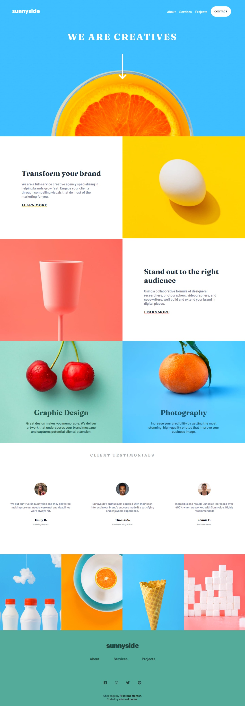
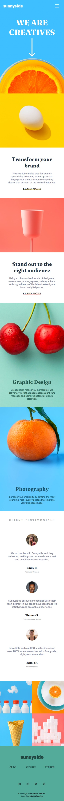

# Frontend Mentor - Sunnyside agency landing page solution

This is a solution to the [Sunnyside agency landing page challenge on Frontend Mentor](https://www.frontendmentor.io/challenges/sunnyside-agency-landing-page-7yVs3B6ef). Frontend Mentor challenges help you improve your coding skills by building realistic projects.

## Table of contents

- [Overview](#overview)
  - [The challenge](#the-challenge)
  - [Screenshot](#screenshot)
  - [Links](#links)
- [My process](#my-process)
  - [Built with](#built-with)
  - [What I learned](#what-i-learned)
  - [Continued development](#continued-development)
  - [Useful resources](#useful-resources)
- [Author](#author)
- [Acknowledgments](#acknowledgments)

## Overview

### The challenge

Users should be able to:

- View the optimal layout for the site depending on their device's screen size
- See hover states for all interactive elements on the page

### Screenshot




### Links

- [Solution URL here](https://github.com/mishael-codes/sunnyside-agency-landing-page-main)
- [Live Site URL here](https://mishael-codes.github.io/sunnyside-agency-landing-page-main/)

## My process

### Built with

- Semantic HTML5 markup
- CSS custom properties
- Flexbox
- CSS Grid
- Mobile-first workflow
- Vanilla JavaScript
- [Font Awesome Icons](https://fontawesome.com/)
### What I learned

In the course of attempting this project, I learned about the javascript ```.contains()``` method which I used with the ```classList``` property to check if an element has a class and going further to use an ```if``` statement to make a decision based on whether it atrributes to true or false.

I also re-learned ```z-index: -1;``` which is a negative value to lower the display priority of an element. I used this on ```<a href="">LEARN MORE</a>``` after applying the ```:after``` pseudo class to it to achieve the expected result.

I definitely learnt more about how the css ```position: ;``` property to properly position elements on the screen as well as css ```@media screen``` to make the site responsive across all screen sizes.

### Continued development
I will continue to learn about the css ```grid``` property to better understand it and use it more often in future projects.


### Useful resources

- [CSS z-index](https://developer.mozilla.org/en-US/docs/Web/CSS/z-index) - This helped me remember the negative values for the ```z-index``` css property, as well as the importance if reading documentations when I am stuck.
- [The ```picture``` tag](https://www.w3schools.com/tags/tag_picture.asp) - This provided me with information on how to use the ```picture``` html tag which helps to specify the  source for more than one image based on screen sizes

## Author

- Twitter - [@mishael_codes](https://www.twitter.com/mishael_codes)
- Instagram - [@mishael_codes](https://www.instagram.com/mishael_codes)
- Frontend Mentor - [@mishael-codes](https://www.frontendmentor.io/profile/mishael-codes)
